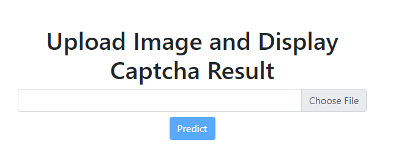
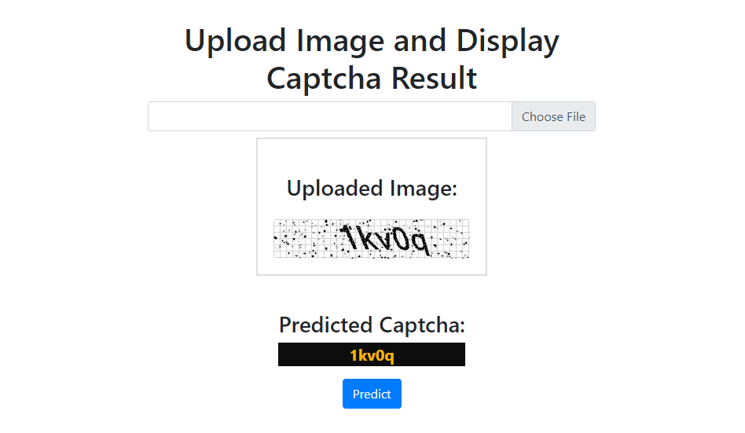

# Image Captcha Solver



## Overview

Image Captcha Solver is a Python application that uses deep learning techniques to predict the text content of a captcha image. The application is designed to handle captcha images containing a combination of lowercase letters and digits. It includes a training phase performed on Google Colab and a Django-based user interface for predictions.

## Installation

Clone the repository to your local machine:

```bash
git clone https://github.com/Sardar-Aroosh/Captcha_Reader/image-captcha-solver.git
cd image-captcha-solver
```

# Usage
### 1. Training and Predicting with Colab:

Place your trained model (in PyTorch format) in the root directory with the name model.pth.

Run the Jupyter notebook Predict.ipynb on Google Colab to test the captcha solver on custom captcha images.

For integration into your project, you can use the predict_captcha_from_image function from the CaptchaSolver class.


### Using the Django Interface:

After cloning the repository and navigating to the project directory, install the necessary requirements using pip:

``` bash
pip install -r requirements.txt
```
Run the Django server:

```bash
python manage.py runserver
```
Visit http://localhost:8000/ on your web browser, upload a captcha image, and click the "Predict" button to get the prediction.



# Model Architecture
The Image Captcha Solver model is composed of a CNN followed by a RNN. The CNN extracts features from the input captcha image, and the RNN processes the extracted features to predict the text content. The model architecture is as follows:

## CNN Layer:
```bash 
Conv2d (3 input channels, 256 output channels, kernel size 3x3, padding 1x1)
MaxPool2d (kernel size 2x2)
Conv2d (256 input channels, 128 output channels, kernel size 3x3, padding 1x1)
MaxPool2d (kernel size 2x2)
Conv2d (128 input channels, 64 output channels, kernel size 3x3, padding 1x1)
MaxPool2d (kernel size 2x2)
```
### RNN Layer:
```bash 
Linear (576 input features, 128 output features)
Dropout (p=0.2)
GRU (128 input features, 64 hidden features, bidirectional, 2 layers, dropout 0.25)
Linear (128 input features, 64 output features)
Linear (64 input features, num_chars + 1 output features)
```
# Dataset
The captcha dataset used for training this model contains captcha images with a combination of lowercase letters and digits. The dataset was preprocessed and augmented using the Albumentations library to enhance model performance.

# How to Contribute
Contributions to this project are welcome. If you find any bugs or want to add new features, please open an issue or submit a pull request. Please follow the existing coding style and conventions.

# License
This project is licensed under the MIT License - see the LICENSE file for detail

```bash
Remember to replace the placeholder URLs (like `https://your-image-url.com/captcha_solver.png`) with the actual URLs of your images.
```